<!-- Profile README for github.com/PrasannakumarKasindala -->
<!-- Commit this file plus assets/banner.svg to a repo named PrasannakumarKasindala -->

  

  <em>I build data platforms that can prove they are correct: pipelines that reconcile to the dollar, dimensions that keep their history, and lakehouses that do not silently drift.</em>

  
  
  

---

## The numbers

<table align="center">
  <tr>
    <td align="center" width="20%">⏳ <b>4+ years</b> data engineering</td>
    <td align="center" width="20%">🏢 <b>Amazon & Intuit</b> enterprise data teams</td>
    <td align="center" width="20%">📦 <b>5 OSS tools</b> shipped & tested</td>
    <td align="center" width="20%">💵 <b>$3.19M</b> reconciled to the cent</td>
    <td align="center" width="20%">🎓 <b>M.S. Data Analytics</b> Indiana Wesleyan, 2024</td>
  </tr>
</table>

---

## Tech stack, by depth

Not a logo wall. This is where my time has actually gone:

| Level | Stack | Signal |
|---|---|---|
|  | PySpark · Spark SQL · Python · SQL · AWS (Glue, S3, EMR, Redshift, Athena) | Daily driver across both roles; partitioning, AQE, and file-layout tuning |
|  | Delta Lake · Kafka · Spark Structured Streaming · Airflow · dbt · Snowflake · Databricks | Built medallion pipelines, CDC streams, SCD2 models, and dbt marts in production |
|  | Terraform · Docker · GitHub Actions · Great Expectations · Iceberg · DuckDB · Scala | Infra as code, CI, data contracts, and the query engines behind my OSS tools |

  

---

## 🔭 Current focus

At Amazon, building the batch and streaming backbone for enterprise analytics:

- **Medallion pipelines on Databricks + Delta Lake**: bronze, silver, and gold layers feeding curated reporting datasets
- **Real-time paths with Kafka + Spark Structured Streaming** for low-latency operational events
- **Cost and performance tuning**: partitioning, caching, adaptive query execution, and Delta file compaction to cut cluster spend
- **Automated data quality**: schema enforcement, reconciliation, and freshness checks so bad batches stop before they publish

---

## 🧱 Featured work (real, runnable, with real numbers)

Every repo below installs with pip, runs offline, and prints the numbers its README claims.

| Project | What it proves | Headline number |
|---|---|---|
| [**retail-lakehouse**](https://github.com/PrasannakumarKasindala/retail-lakehouse) | Batch medallion: Delta bronze/silver, dbt gold star schema with SCD2, GE gates, cross-layer reconciliation | **$3,198,044.17** fact revenue == silver revenue, to the cent |
| [**cdc-streaming-pipeline**](https://github.com/PrasannakumarKasindala/cdc-streaming-pipeline) | Postgres CDC -> Kafka -> Iceberg with exactly-once, out-of-order merge | Naive merge drifts **$142,279.93**; LSN merge holds parity at **~888k events/s** |
| [**warehouse-migration-kit**](https://github.com/PrasannakumarKasindala/warehouse-migration-kit) | Legacy RDBMS -> cloud warehouse migration with cross-engine checksum reconciliation | **422,003 rows** migrated at **190k rows/s**, drift caught in dollars |
| [**scd2-validator**](https://github.com/PrasannakumarKasindala/scd2-validator) | Seven window-function invariant checks on SCD2 dimensions, blast radius in $ | Read-only; every violation priced against the fact table |
| [**silt**](https://github.com/PrasannakumarKasindala/silt) | The "small-file tax" on Delta tables, priced per partition from the _delta_log alone | Compaction ROI + payback days; never runs OPTIMIZE for you |

---

## 🔀 Pivot point

Three years shipping finance and product pipelines at **Intuit** taught me how data platforms behave at scale. Instead of coasting on that, I stepped away to finish an **M.S. in Management Data Analytics**, then came back to the hardest version of the job at **Amazon**. The gap in my timeline is not a gap; it is the investment that turned an ETL developer into a platform engineer who thinks about correctness, cost, and governance first.

---

## 📊 GitHub activity

  
  

---

## 🎧 Outside the code

<!-- EDIT ME: your resume lists no hobbies, so fill these in or delete the section. Examples: -->
<!-- ♟️ Chess · 🏏 Cricket · 🎬 Film scores · 🥾 North Georgia trails -->

---

## 🤝 Quick connect

  
  
  
  <!-- Add when ready: Twitter/X, portfolio site -->

  

  Built like my pipelines: no claim without a number behind it.

